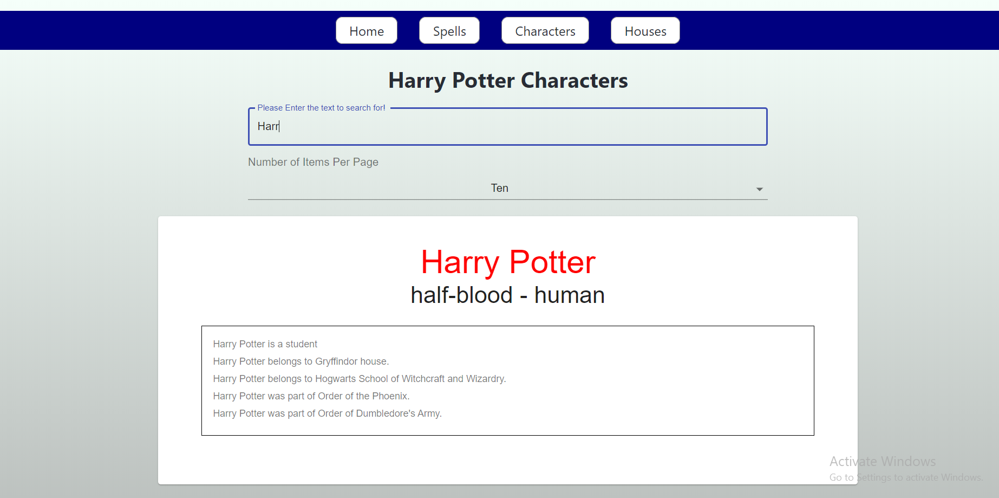

# A Harry Potter database application in React using Material UI.

An application to retrieve information about Harry Potter characters, spells and houses using API 
provided by https://www.potterapi.com/ . Functionalities of the
application include custom filtering and pagination. Further, UI improvements 
using animation is in the pipeline which I might consider doing in future. 
I think it's a good choice to play around with and it's pretty easy to integrate. It does not come
with rate limit. For UI I have used material UI kit, it's awesome. I am lately using it a lot, it's just a breeze to customize while
still leveraging the power of custom UI components it provides. 

## Getting Started

* If you have worked with React and npm projects before, you'd know the procedure is fairly simply. Take the clone of the project, run 'npm install' and then
type in 'npm start'. It's the only script in this project thus far.

* For people not coming from node background, you need to install Node.js
runtime environment on your system and then install packages and using it to run the project following the steps described above. 

* Additionally, the API key is stored in a constant file and must be replaced
with your API key which you can get it from this link https://www.potterapi.com/

* Please find the screenshots of the application attached below.

## Built With

* [React JS](https://reactjs.org/)
* [Material UI](https://material-ui.com/)
* [React Redux](https://redux.js.org/)
* [HTML + CSS + SCSS](https://www.w3schools.com/html/html_css.asp)

## Authors

* **Amit Prafulla (APFirebolt)** - (http://amitprafull.com/)

## License

This project is licensed under the MIT License - see the [LICENSE.md](LICENSE.md) file for details

## Screenshots

Please find some of the screenshots of the application. Below is the screenshot depicting search pokemon page with
applied filters.

The character search page.

House detail page screen shot.

A screen shot showing query made for a data which does not 
exist.

All Spells that exist in Harry Potter universe along with
search filtering option (pagination included).

Search filtering on the characters page.

This project was bootstrapped with [Create React App](https://github.com/facebook/create-react-app).

